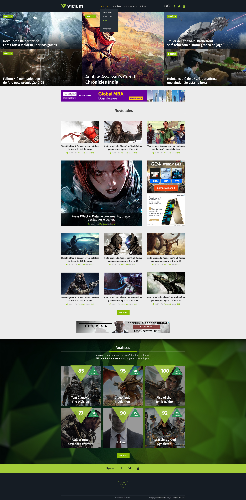

# Vicium


# Mission
Layot do youtube


## .htaccess

```

# Evita injection

Options +FollowSymLinks
RewriteEngine On
RewriteCond %{QUERY_STRING} (&lt;|%3C).*script.*(&gt;|%3E) [NC,OR]
RewriteCond %{QUERY_STRING} GLOBALS(=|[|%[0-9A-Z]{0,2}) [OR]
RewriteCond %{QUERY_STRING} _REQUEST(=|[|%[0-9A-Z]{0,2})
RewriteRule ^(.*)$ index.php [F,L]


# Remove a navegação pelos arquivos

Options -Indexes


# Proteger o arquivo wp-config

<files wp-config.php> order allow,deny deny from all </files>


# Evita hotlink
RewriteEngine On RewriteCond %{HTTP_REFERER} !^$ RewriteCond %{HTTP_REFERER} !^http://(www\.)?yourdomain.com/.*$ [NC] RewriteRule \.(gif|jpg)$ http://www.yoursite.com/hotlink.gif [R,L]


# Evita acesso ao .htacess
<Files .htaccess> order allow,deny deny from all </Files>

```

/wp-content/plugins/ criar um index.html em branco
